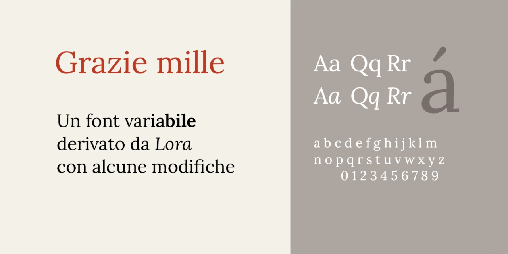
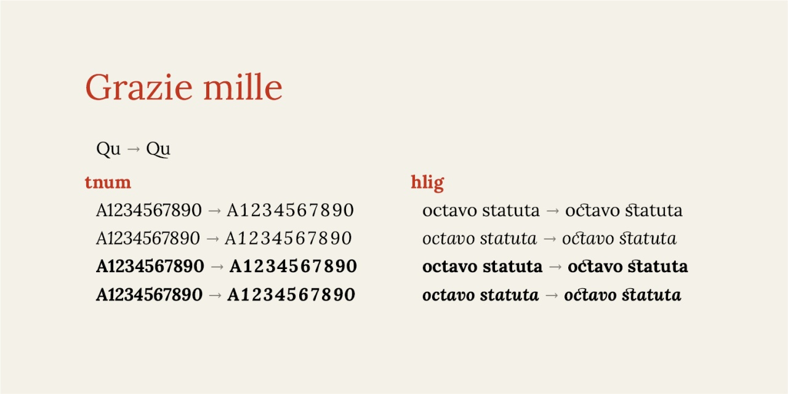

# Grazie mille
- Versione 1.101: versione iniziale.

Per testare il font nella versione variabile, vedere la [pagina interattiva](https://m-casanova.github.io/GrazieMille/).

## Formati
La versione variabile è disponibile nella cartella *font* (formati TTF e WOFF2).
La versione fissa (Regular, News, Medium, SemiBold, Bold con corrispondenti corsivi) è disponibile nelle cartelle *otf* (formato OTF), *ttf* (formato TTF), *woff* (formato WOFF) e *woff2* (formato WOFF2).

## Descrizione

*Grazie mille* è un test (con un sottoinsieme di caratteri limitato) per la creazione  di un font variabile derivato dal font [*Lora*](https://github.com/cyrealtype/Lora-Cyrillic).

